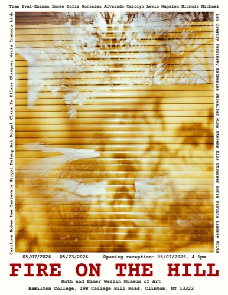

# Build Plan — Add "Fire on the Hill" (Wellin Museum) to Exhibitions

**For:** Claude Code, executing in the repo root `/Users/peterp/Projects/grisha.studio`.
**Goal:** Add the Wellin Museum group show as (1) a row on `exhibitions.html` and (2) a full detail page `exhibitions/fire-on-the-hill.html`, matching the existing `advanced-ceramics-group-show.html`. Follow steps verbatim; everything needed is specified below. **Do not improvise paths, filenames, or copy.**

---

## Locked facts & decisions

| Field | Value |
|---|---|
| Slug | `fire-on-the-hill` |
| Title | Fire on the Hill |
| Type | Group Exhibition |
| Date (display) | May 7–23, 2026 |
| Date (machine) | start `2026-05-07`, end `2026-05-23` |
| List-row year | 2026 |
| Venue | Ruth and Elmer Wellin Museum of Art, Hamilton College, Clinton, NY |
| Works shown (link these existing pages) | Tower of Babel, The Wishing Well, Wood Gong |
| Poster | used as list-row **thumbnail** + detail-page **hero** |
| Description | short blurb (placeholder text provided below; co-artists unconfirmed) |
| Source images | `Wellin Museum show/` in repo root (1 poster PNG + 5 installation JPEGs) |

Source files in `Wellin Museum show/`:
`IMG_2730.PNG` (poster, 4830×6250) · `SS-18.JPEG` (3000×2543, wide gallery shot) · `SS-15.JPEG` · `SS-10.JPEG` · `SS-12.JPEG` · `SS-16.JPEG` (each 2000×3000 portrait).

---

## Step 1 — Create image assets

Create directory `assets/img/exhibitions/fire-on-the-hill/` (new `exhibitions/` branch under `assets/img/` — it does not exist yet).

Process with macOS `sips` (built-in; this repo's `plan.md` standardizes on it). Run from repo root:

```bash
SRC="Wellin Museum show"
DST="assets/img/exhibitions/fire-on-the-hill"
mkdir -p "$DST"

# Poster → web (hero) + thumb (list row)
sips -s format jpeg -Z 1600 -s formatOptions 82 "$SRC/IMG_2730.PNG" --out "$DST/poster-web.jpg"
sips -s format jpeg -Z 500  -s formatOptions 80 "$SRC/IMG_2730.PNG" --out "$DST/poster-thumb.jpg"

# Installation photos → web only (gallery uses -web directly, like the existing show)
sips -s format jpeg -Z 1600 -s formatOptions 82 "$SRC/SS-18.JPEG" --out "$DST/install-1-web.jpg"   # wide gallery view
sips -s format jpeg -Z 1600 -s formatOptions 82 "$SRC/SS-15.JPEG" --out "$DST/install-2-web.jpg"
sips -s format jpeg -Z 1600 -s formatOptions 82 "$SRC/SS-10.JPEG" --out "$DST/install-3-web.jpg"
sips -s format jpeg -Z 1600 -s formatOptions 82 "$SRC/SS-12.JPEG" --out "$DST/install-4-web.jpg"
sips -s format jpeg -Z 1600 -s formatOptions 82 "$SRC/SS-16.JPEG" --out "$DST/install-5-web.jpg"
```

**Verify after:** open each output; confirm orientation is upright (portraits tall, `install-1` wide). If any portrait came out sideways, rotate in place, e.g. `sips -r 90 "$DST/install-2-web.jpg" --out "$DST/install-2-web.jpg"`. Confirm every `-web.jpg` is 100–350 KB and `poster-thumb.jpg` < 80 KB.

---

## Step 2 — Relocate originals (keep repo clean)

The `Wellin Museum show/` folder sits in the repo root and is **not** git-ignored (unlike `Architecture Material/`), so the 37 MB poster + raw photos would otherwise be committed. Move originals into the ignored `media-source/` tree, then remove the root folder:

```bash
mkdir -p "media-source/exhibitions/fire-on-the-hill"
mv "Wellin Museum show/"* "media-source/exhibitions/fire-on-the-hill/"
rmdir "Wellin Museum show"
```

(`media-source/` is already in `.gitignore`, so originals stay on disk but out of git. No `.gitignore` edit needed.)

---

## Step 3 — Add hero CSS

Append to `assets/css/exhibition-detail.css` (the `.exh-desc` classes used below already exist; only `.exh-hero` is new):

```css
/* ─────────────────────────────────────────────
   EXHIBITION HERO (poster)
───────────────────────────────────────────── */
.exh-hero {
    position: relative; z-index: 1;
    padding: 44px 56px 0; max-width: 1320px; margin: 0 auto;
}
.exh-hero .image-zoom-link { display: block; }
.exh-hero img {
    width: 100%; max-height: 82vh; object-fit: contain;
    border: 2px solid #000; background: var(--surface); display: block;
}
@media (max-width: 960px) { .exh-hero { padding: 32px 28px 0; } }
```

`object-fit: contain` keeps the tall poster uncropped on the hero.

---

## Step 4 — Create the detail page

Create `exhibitions/fire-on-the-hill.html` with **exactly** this content:

```html
<!DOCTYPE html>
<html lang="en">
<head>
    <meta charset="UTF-8">
    <meta name="viewport" content="width=device-width, initial-scale=1.0">
    <title>Fire on the Hill — Gregory Parizhsky</title>
    <meta name="description" content="Fire on the Hill (2026), a group exhibition at the Ruth and Elmer Wellin Museum of Art, Hamilton College, Clinton, NY. Featuring sculpture by Gregory Parizhsky.">
    <meta name="keywords" content="Gregory Parizhsky, Greg Parizhsky, Parizhsky, Fire on the Hill, Wellin Museum of Art, Hamilton College, sculpture exhibition">
    <meta name="author" content="Gregory Parizhsky">
    <meta name="robots" content="index, follow, max-image-preview:large">
    <link rel="canonical" href="https://grisha.studio/exhibitions/fire-on-the-hill.html">

    <meta property="og:type" content="article">
    <meta property="og:site_name" content="Gregory Parizhsky">
    <meta property="og:title" content="Fire on the Hill — Gregory Parizhsky">
    <meta property="og:description" content="Fire on the Hill (2026), a group exhibition at the Ruth and Elmer Wellin Museum of Art, Hamilton College.">
    <meta property="og:url" content="https://grisha.studio/exhibitions/fire-on-the-hill.html">
    <meta property="og:image" content="https://grisha.studio/assets/img/exhibitions/fire-on-the-hill/poster-web.jpg">
    <meta name="twitter:card" content="summary_large_image">
    <meta name="twitter:title" content="Fire on the Hill — Gregory Parizhsky">
    <meta name="twitter:description" content="Fire on the Hill (2026), a group exhibition at the Ruth and Elmer Wellin Museum of Art, Hamilton College.">
    <meta name="twitter:image" content="https://grisha.studio/assets/img/exhibitions/fire-on-the-hill/poster-web.jpg">

    <link rel="preconnect" href="https://fonts.googleapis.com">
    <link rel="preconnect" href="https://fonts.gstatic.com" crossorigin>
    <link href="https://fonts.googleapis.com/css2?family=Instrument+Serif:ital@0;1&family=DM+Sans:opsz,wght@9..40,300;9..40,400;9..40,500&family=DM+Mono:wght@300;400&display=swap" rel="stylesheet">
    <link rel="stylesheet" href="../assets/css/base.css">
    <link rel="stylesheet" href="../assets/css/exhibition-detail.css">
    <link rel="stylesheet" href="../assets/css/site-loader.css">
    <link rel="stylesheet" href="../assets/css/work-lightbox.css">
    <script src="../assets/js/site-loader.js" defer></script>
    <script src="../assets/js/work-lightbox.js" defer></script>

    <link rel="icon" href="/favicon.svg" type="image/svg+xml" sizes="any">
    <link rel="icon" href="/favicon.png" type="image/png">
    <link rel="apple-touch-icon" href="/favicon.png">

    <script type="application/ld+json">
    {
      "@context": "https://schema.org",
      "@type": "ExhibitionEvent",
      "name": "Fire on the Hill",
      "url": "https://grisha.studio/exhibitions/fire-on-the-hill.html",
      "startDate": "2026-05-07",
      "endDate": "2026-05-23",
      "location": {
        "@type": "Place",
        "name": "Ruth and Elmer Wellin Museum of Art",
        "address": {
          "@type": "PostalAddress",
          "streetAddress": "198 College Hill Road",
          "addressLocality": "Clinton",
          "addressRegion": "NY",
          "postalCode": "13323"
        }
      },
      "performer": {
        "@type": "Person",
        "name": "Gregory Parizhsky",
        "alternateName": ["Greg Parizhsky", "Parizhsky"],
        "url": "https://grisha.studio/"
      },
      "workFeatured": [
        {"@type": "VisualArtwork", "name": "Tower of Babel", "url": "https://grisha.studio/work/tower-of-babel.html"},
        {"@type": "VisualArtwork", "name": "The Wishing Well", "url": "https://grisha.studio/work/wishing-well.html"},
        {"@type": "VisualArtwork", "name": "Wood Gong", "url": "https://grisha.studio/work/wood-gong.html"}
      ]
    }
    </script>
</head>
<body>
    <div id="loader" class="site-loader" aria-hidden="true"><p class="loader-mark">G · P</p></div>

    <div id="progress"></div>
    <div class="ambient"></div>

    <a class="skip-link" href="#main">Skip to content</a>

    <nav id="nav" aria-label="Primary">
        <a href="../index.html" class="nav-mark">G · P</a>
        <ul class="nav-list">
            <li><a href="../index.html">Home</a></li>
            <li><a href="../gallery/ceramic.html">Works</a></li>
            <li><a href="../exhibitions.html" aria-current="page">Exhibitions</a></li>
            <li><a href="../index.html#about">About</a></li>
            <li><a href="../index.html#contact">Contact</a></li>
        </ul>
    </nav>

    <div id="main" class="back-wrap">
        <a href="../exhibitions.html" class="back-link">Exhibitions</a>
    </div>

    <header class="exh-header reveal">
        <div class="exh-header-left">
            <div class="exh-meta-row">
                <span class="exh-type">Group Exhibition</span>
                <span>—</span>
                <span>2026</span>
            </div>
            <h1 class="exh-h1">Fire on the Hill</h1>
        </div>
        <div class="exh-header-right reveal" style="--d:60ms">
            <div class="exh-meta-block">
                <div class="exh-meta-item">
                    <span class="exh-meta-key">Date</span>
                    <span class="exh-meta-val">May 7–23, 2026</span>
                </div>
                <div class="exh-meta-item">
                    <span class="exh-meta-key">Venue</span>
                    <span class="exh-meta-val">Ruth and Elmer Wellin Museum of Art, Hamilton College, Clinton, NY</span>
                </div>
            </div>
        </div>
    </header>

    <section class="exh-hero reveal" aria-label="Exhibition poster">
        <a class="image-zoom-link" href="../assets/img/exhibitions/fire-on-the-hill/poster-web.jpg" target="_blank" rel="noopener noreferrer">
            
        </a>
    </section>

    <section class="exh-desc reveal" style="--d:40ms" aria-label="About the exhibition">
        <div class="exh-desc-label">About</div>
        <div class="exh-desc-body">
            <p><em>Fire on the Hill</em> was a group exhibition at the Ruth and Elmer Wellin Museum of Art, Hamilton College, on view May 7–23, 2026. Gregory Parizhsky presented three sculptures — <em>Tower of Babel</em>, <em>The Wishing Well</em>, and <em>Wood Gong</em> — alongside work by fellow Hamilton College artists.</p>
            <p>Placeholder text — to be finalized with the curatorial framing and full list of exhibiting artists.</p>
        </div>
    </section>

    <section class="exh-gallery" aria-label="Installation photographs">
        <div class="exh-gallery-header reveal">
            <span>Installation</span>
            <span class="exh-gallery-count">05</span>
        </div>
        <div class="exh-gallery-grid">
            <div class="g-img reveal" style="--d:40ms">
                <a class="image-zoom-link" href="../assets/img/exhibitions/fire-on-the-hill/install-1-web.jpg" target="_blank" rel="noopener noreferrer">
                    
                </a>
            </div>
            <div class="g-img reveal" style="--d:60ms">
                <a class="image-zoom-link" href="../assets/img/exhibitions/fire-on-the-hill/install-2-web.jpg" target="_blank" rel="noopener noreferrer">
                    
                </a>
            </div>
            <div class="g-img reveal" style="--d:80ms">
                <a class="image-zoom-link" href="../assets/img/exhibitions/fire-on-the-hill/install-3-web.jpg" target="_blank" rel="noopener noreferrer">
                    
                </a>
            </div>
            <div class="g-img reveal" style="--d:100ms">
                <a class="image-zoom-link" href="../assets/img/exhibitions/fire-on-the-hill/install-4-web.jpg" target="_blank" rel="noopener noreferrer">
                    
                </a>
            </div>
            <div class="g-img reveal" style="--d:120ms">
                <a class="image-zoom-link" href="../assets/img/exhibitions/fire-on-the-hill/install-5-web.jpg" target="_blank" rel="noopener noreferrer">
                    
                </a>
            </div>
        </div>
    </section>

    <section class="exh-works" aria-label="Works shown">
        <div class="exh-works-header reveal">
            <span>Works Shown</span>
            <span class="exh-works-count">03</span>
        </div>
        <div class="exh-works-grid">
            <a href="../work/tower-of-babel.html" class="exh-work-card reveal">
                <div class="exh-work-img">
                    
                </div>
                <span class="exh-work-title">Tower of Babel</span>
                <span class="exh-work-year">2026 · Ceramic</span>
            </a>
            <a href="../work/wishing-well.html" class="exh-work-card reveal" style="--d:60ms">
                <div class="exh-work-img">
                    
                </div>
                <span class="exh-work-title">The Wishing Well</span>
                <span class="exh-work-year">2026 · Glazed Stoneware</span>
            </a>
            <a href="../work/wood-gong.html" class="exh-work-card reveal" style="--d:80ms">
                <div class="exh-work-img">
                    
                </div>
                <span class="exh-work-title">Wood Gong</span>
                <span class="exh-work-year">2026 · Wood</span>
            </a>
        </div>
    </section>

    <footer>
        <div class="footer-left"><span>Gregory Parizhsky</span><a href="https://www.instagram.com/grisha.studio/" class="footer-ig" target="_blank" rel="noopener noreferrer" aria-label="Instagram"><svg xmlns="http://www.w3.org/2000/svg" width="14" height="14" viewBox="0 0 24 24" fill="none" stroke="currentColor" stroke-width="2" stroke-linecap="round" stroke-linejoin="round" aria-hidden="true"><rect x="2" y="2" width="20" height="20" rx="5" ry="5"/><path d="M16 11.37A4 4 0 1 1 12.63 8 4 4 0 0 1 16 11.37z"/><line x1="17.5" y1="6.5" x2="17.51" y2="6.5"/></svg></a></div>
        <span class="footer-meta"><a class="footer-credit" href="https://tech-savvies.com/">Made by Tech-Savvvies</a><span>&copy; 2026</span></span>
    </footer>

    <script>
        const prog = document.getElementById('progress');
        const nav = document.getElementById('nav');
        window.addEventListener('scroll', () => {
            const pct = window.scrollY / (document.documentElement.scrollHeight - window.innerHeight);
            prog.style.transform = `scaleX(${pct})`;
            nav.classList.toggle('scrolled', window.scrollY > 48);
        }, { passive: true });
        const observer = new IntersectionObserver(entries => {
            entries.forEach(e => { if (e.isIntersecting) { e.target.classList.add('in'); observer.unobserve(e.target); } });
        }, { threshold: 0.07, rootMargin: '0px 0px -52px 0px' });
        document.querySelectorAll('.reveal').forEach(el => observer.observe(el));
    </script>
</body>
</html>
```

---

## Step 5 — Add the row to `exhibitions.html`

In `exhibitions.html`, find the line `<section class="exhibition-list" aria-label="Exhibitions">`. **Immediately after** it (so this show appears first, above Advanced Ceramics — newest first), insert:

```html
            <article class="exhibition-item">
                <a href="./exhibitions/fire-on-the-hill.html" class="exhibition-row">
                    <p class="exhibition-date">2026</p>
                    <div>
                        <h2 class="exhibition-title">Fire on the Hill</h2>
                        <p class="exhibition-meta">Ruth and Elmer Wellin Museum of Art<br>Hamilton College, Clinton, NY</p>
                    </div>
                    <div class="exhibition-thumb">
                        
                    </div>
                </a>
            </article>
```

Leave the existing Advanced Ceramics `<article>` in place, after this one. (Note: the list thumbnail is the poster cropped to a 16:10 frame via `object-fit: cover`, so it shows the poster's center band — this is the chosen behavior.)

---

## Step 6 — SEO files

In `sitemap.xml`, add a new `<url>` block (place it next to the existing `exhibitions.html` entry) and update the `lastmod` on the `exhibitions.html` entry to `2026-06-06`:

```xml
  <url>
    <loc>https://grisha.studio/exhibitions/fire-on-the-hill.html</loc>
    <lastmod>2026-06-06</lastmod>
    <changefreq>monthly</changefreq>
    <priority>0.6</priority>
  </url>
```

Then check `llms.txt`: if it enumerates exhibition pages, add a "Fire on the Hill" line in the same format; if it does not list individual exhibitions, leave it.

---

## Step 7 — Build, verify, commit

1. **Build:** run `bash scripts/build-site.sh` (regenerates `site-dist/`; it copies `assets`, `exhibitions`, and `exhibitions.html`, and strips `media-source/`).
2. **Serve & screenshot** (e.g. `python3 -m http.server` from repo root) and confirm:
   - `/exhibitions.html` — Fire on the Hill row appears **first**, poster thumbnail loads, links to the detail page.
   - `/exhibitions/fire-on-the-hill.html` — header, poster hero (uncropped, click-to-zoom works via lightbox), About blurb, 5 installation photos (correct orientation), and 3 Works-Shown cards each linking to the right work page.
   - No broken images (check the browser console / network tab for 404s on any `assets/img/exhibitions/fire-on-the-hill/*` path).
3. **Asset budget:** every `-web.jpg` 100–350 KB, `poster-thumb.jpg` < 80 KB.
4. **Repo cleanliness:** `git status` shows the new HTML/CSS, the new `assets/img/exhibitions/fire-on-the-hill/*.jpg`, and the sitemap edit — and does **not** show `Wellin Museum show/` or anything under `media-source/`.
5. **Commit:** `git add -A && git commit -m "Add Fire on the Hill (Wellin Museum) exhibition page"` then push (Netlify auto-deploys per `netlify.toml`).

---

## Acceptance criteria

- [ ] `exhibitions/fire-on-the-hill.html` exists and renders with header, poster hero, blurb, 5-photo installation gallery, and 3 Works-Shown cards.
- [ ] `exhibitions.html` lists Fire on the Hill first, with the poster thumbnail, linking to the detail page.
- [ ] All 7 images live under `assets/img/exhibitions/fire-on-the-hill/`, correctly oriented and within size budget.
- [ ] Lightbox zoom works on poster + installation photos; Works-Shown cards link to `tower-of-babel`, `wishing-well`, `wood-gong`.
- [ ] `sitemap.xml` includes the new URL; raw `Wellin Museum show/` no longer in the repo (moved to ignored `media-source/`).
- [ ] Site builds clean; commit pushed.

## Follow-up (not blocking)

- Replace the placeholder second paragraph of the About blurb with the real curatorial text + confirmed list of co-exhibiting artists.
- If any installation photo doesn't correspond to a Parizhsky work, it can stay (they're installation views), but verify none accidentally foregrounds another artist's piece as if it were Greg's.
